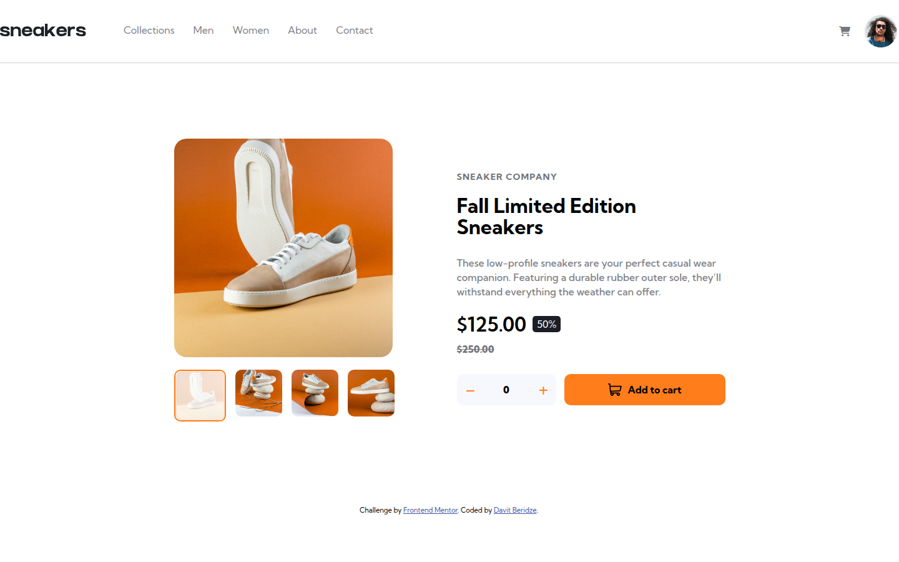
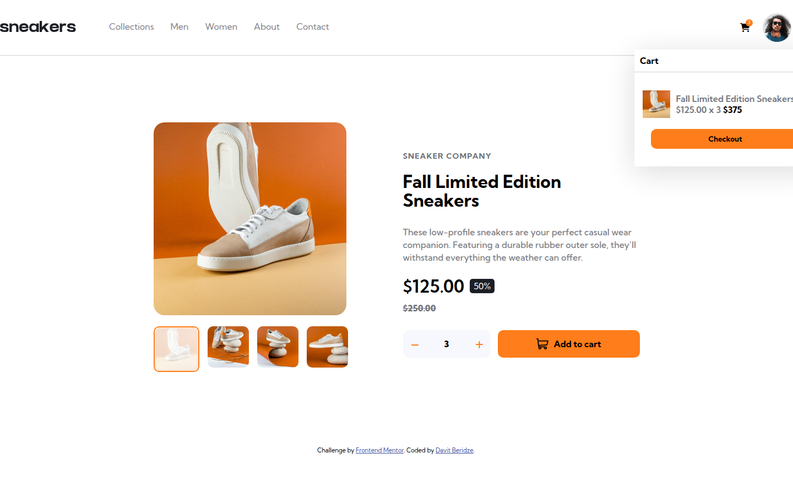
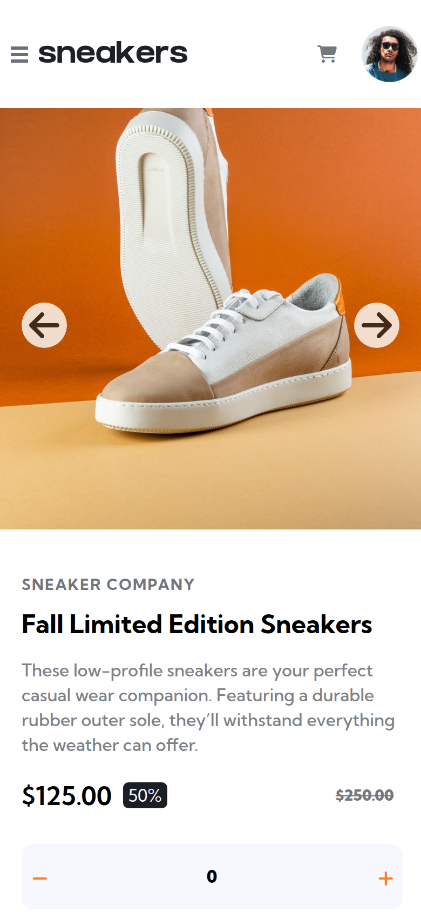

# E-commerce Product Page

My solution to the [E-commerce product page](https://www.frontendmentor.io/challenges/ecommerce-product-page-UPsZ9MJp6) challenge on Frontend Mentor. A sneaker product page with an image gallery, lightbox, and working cart.



| Cart with an item added | Mobile |
| --- | --- |
|  |  |

## Features

- Click a thumbnail to change the main product photo
- Lightbox gallery with its own thumbnails, opened from the main image
- Quantity selector and **Add to cart** button
- Cart dropdown with product, quantity, total price, and a delete button
- Item count badge on the cart icon
- Slide-out navigation menu on mobile

## Built with

- Semantic HTML
- CSS with Flexbox, media queries, and transitions
- Vanilla JavaScript for the gallery, lightbox, and cart
- Font Awesome icons

## Run locally

No build step or dependencies. Open `index.html` in a browser, or serve the folder:

```bash
npx serve .
```
